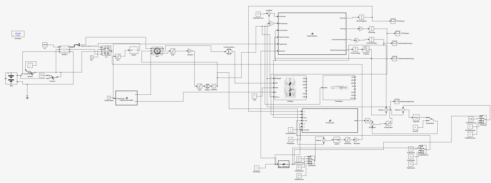
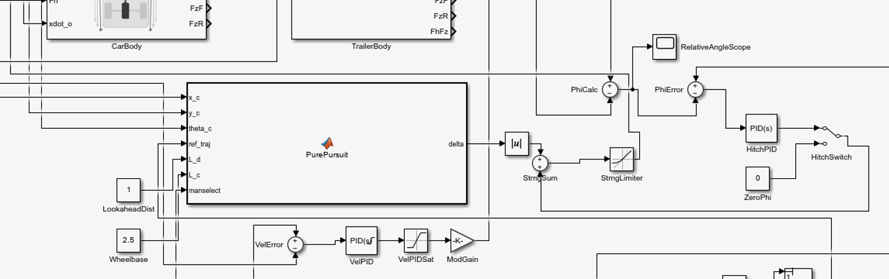
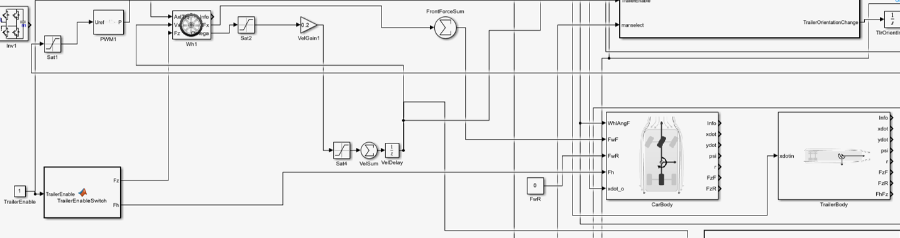
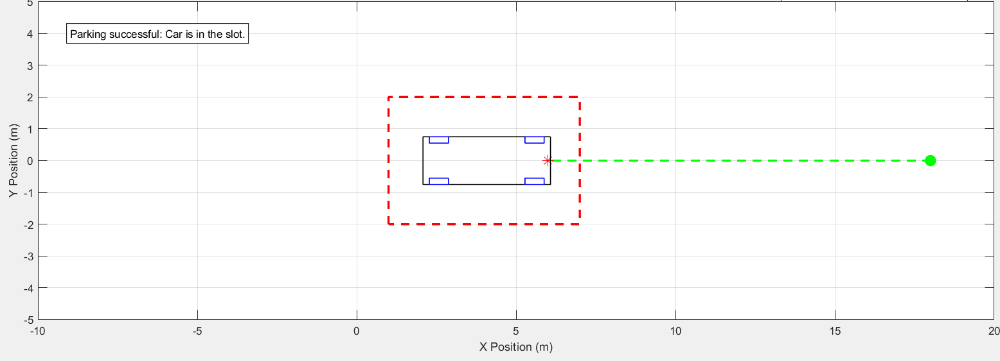

# 🚗 Autonomous Parking Simulation with Car–Trailer System

## 📌 Overview

This project presents the **modelling, simulation, and control** of an autonomous electric vehicle with a trailer using MATLAB/Simulink.

The system is designed to perform multiple driving and parking maneuvers, including forward driving, arc-based parking, and reverse parking, both **with and without a trailer**.

**This project reflects core concepts used in autonomous driving systems, including vehicle modelling, control, and trajectory tracking.**

---

## ⚙️ System Description

The system consists of:

* A **4 m electric vehicle**
* A **6 m trailer** connected via a hitch
* An **electrical drive system** powered by a battery and inverter
* Sensors to measure:

  * position
  * orientation
  * relative angle between car and trailer

The simulation is built in Simulink using a modular architecture.

---

## 🧠 Control Strategy

The control system combines:

* **PID controllers** for velocity and hitch angle control
* **Pure Pursuit algorithm** for trajectory tracking

This enables the system to:

* follow predefined paths
* maintain stability during motion
* correctly align the trailer during maneuvers

---

## 🧩 System Architecture

### 🔹 Simulink Model



---

### 🔹 Control System



---

### 🔹 Vehicle and Trailer Model



---

## 🚗 Maneuvers

The system supports six different scenarios:

1. Parking with arc (with trailer)
2. Straight driving (with trailer)
3. Reverse parking (with trailer)
4. Parking with arc (car only)
5. Straight driving (car only)
6. Reverse parking (car only)

---

## 📊 Results

### 🔹 Example Trajectory



The system successfully:

* follows planned trajectories
* aligns vehicle and trailer during parking
* reaches target positions within acceptable tolerance

---

## ▶️ How to Run

1. Open the Simulink model from the `models/` folder
2. Set the maneuver selection variable:

   ```matlab
   manselect = 1; % choose from 1–6
   ```
3. Run the simulation
4. Run the plotting script:

   ```matlab
   plot_trajectory
   ```

---

## 📈 Key Observations

* PID tuning is critical for stable motion
* Trailer dynamics significantly increase control complexity
* Reverse parking is the most challenging maneuver
* The system demonstrates reliable performance across scenarios

---

## 🧩 Simulation & Code

* The full system is implemented in **Simulink**
* MATLAB scripts are used for:

  * trajectory visualization
  * vehicle geometry rendering
  * maneuver validation

Project structure:

* `models/` → Simulink model
* `scripts/` → MATLAB code
* `results/` → output visualizations

---

## ▶️ Tools Used

* MATLAB
* Simulink (with Simscape)

---

## 🚧 Future Improvements

* Model predictive control (MPC) for advanced trajectory planning
* Sensor integration (LiDAR, camera-based perception)
* Obstacle avoidance in dynamic environments
* Real-time deployment on embedded systems

---

## 💼 Author

**Jessica Sutherns**
https://github.com/jessysutherns

---

## ⭐ Project Significance

This project demonstrates key concepts in autonomous systems:

* Vehicle kinematics and dynamics
* Control system design
* Trajectory tracking
* Multi-body system interaction (car + trailer)

It highlights how simulation and control techniques can be used to solve **real-world autonomous driving and parking problems**.
